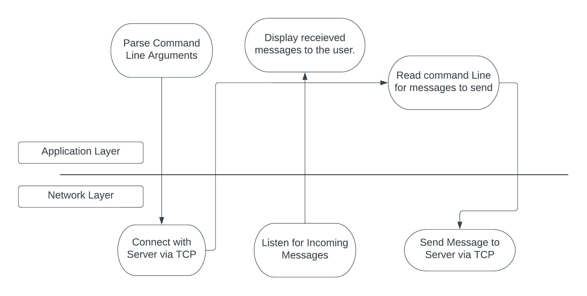
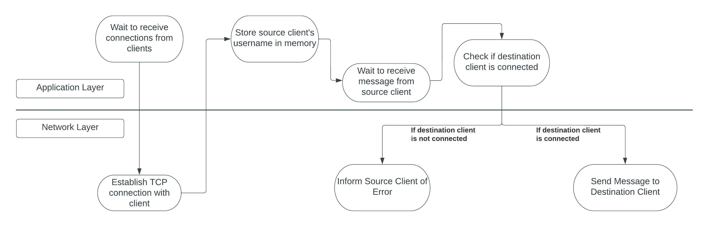

<h1 style="text-align: center; font-size: 3rem;">Machine Problem 2: Private Message Chat Room Application</h1>

This is a simple multi-user chat application. Someone runs the central server, and clients connect to the server with a username. Clients can send direct messages to other clients who are connected - but every message is seen by the server. The server routes messages to their intended recipients.

##  How to run. 

Run the server with

```sh
go run cmd/server/server.go <port>
```

The server needs to know what port to listen for incoming connections on. Once the server is running, clients can connect to it with _unique_ usernames. You can type `exit` to shut down the server and disconnect all clients.

<hr>

Run the client with

```sh
go run cmd/client/client.go <ip> <port> <username>
```

The client needs to know the IP and port of the chat server as well as the username to connect with. You can send a message to another user with `send <username> <message>` and you can quit by typing `exit`.

##  Architecture

The client and server communicate over TCP using a simple protocol. A message from one to the other generally consists of a from field indicating the source process of a message, a to field indicating the destination process and a content field that contains the content of the message. A message also has a error bit that can either be `1` or `0` depending on if a message is an error message. All binary data is sent in Big Endian byte order.

```go
type Message struct {
	To      string
	From    string
	Content string
	Error   bool
}
```

When a client connects to the server, it sends the length of the username (in bytes). It then sends the username as an ASCII string. If the server detects the username is taken, it will send a message with the error field set informing the client that the username is not available. The server will then reject the client's connection. The client also does not allow the user to connect with usernames longer than the limit.

Once the client is connected, it spawns a new thread to handle incoming messages, and it listens for user input on the main thread. The user can send messages to other users by issuing the `send` command. When this happens, the client creates a message with the `to` field containing it's username and the  `content` field containing the message's content. The username and message have length limits, so if the header indicates that either is longer than its limit, the client is disconnected. Again, the client does not allow you to send messages to the server if these limits are exceeded, so anybody who manages to send such a message to the server must not be using the client. This normally wouldn't be a problem, but we don't want to leave the possibility of an attacker sending 0xFFFFFFFF or some large number as the header and forcing the server to allocate a lot of memory.

### Client Flow



## Server Flow


WIP
